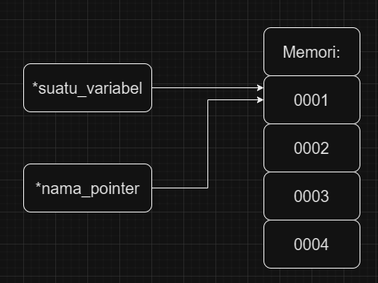

 # [Pointer](https://learn.microsoft.com/id-id/cpp/cpp/pointers-cpp?view=msvc-170)
Pointer adalah variabel yang menyimpan **alamat memori objek**

Pointer digunakan secara ekstensif di C dan C++ untuk tiga tujuan utama: 
* Untuk mengalokasikan objek baru pada timbunan;
* Untuk meneruskan fungsi ke fungsi lain;
* Untuk melakukan iterasi atas elemen dalam array atau struktur data lainnya.

Untuk mendeklarasikan pointer digunakan sintaks sebagai berikut:
*nama_pointer = &suatu_variabel

  
pointer akan menggunakan alamat memori yang sama dengan variabel tersebut
